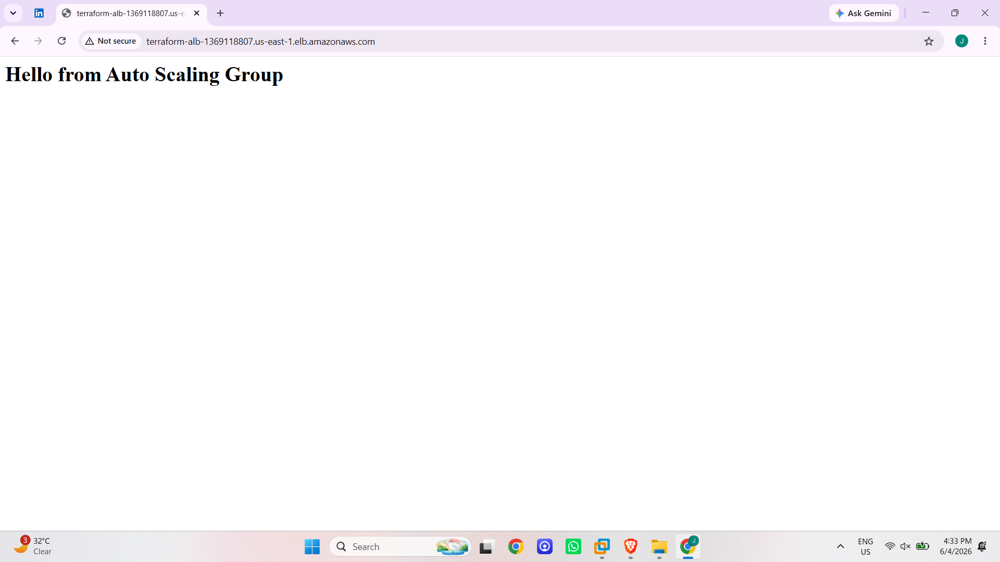
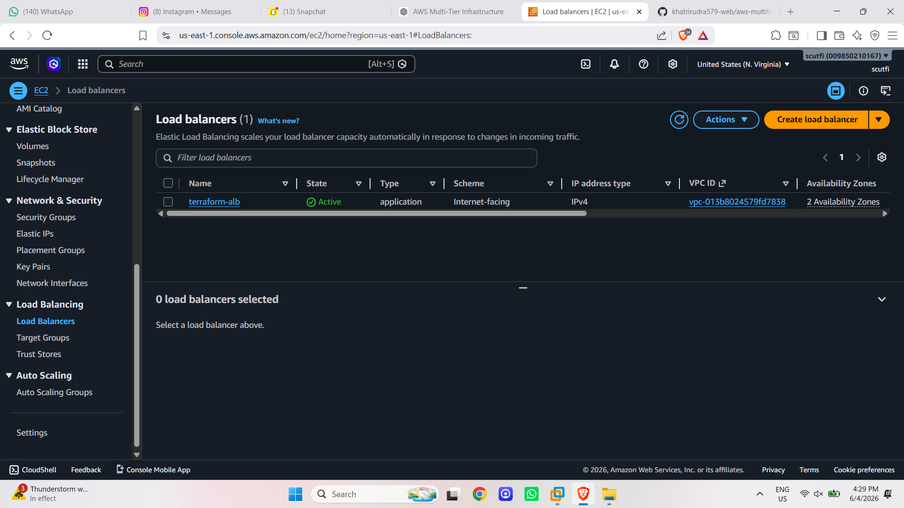
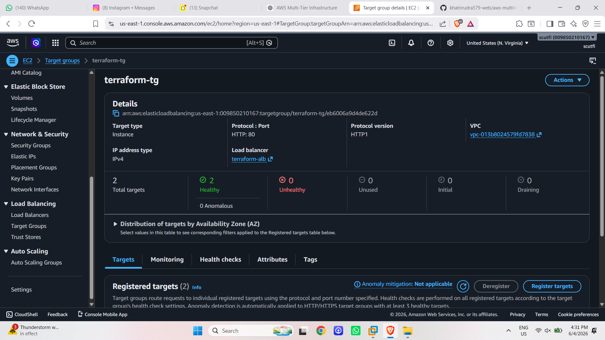
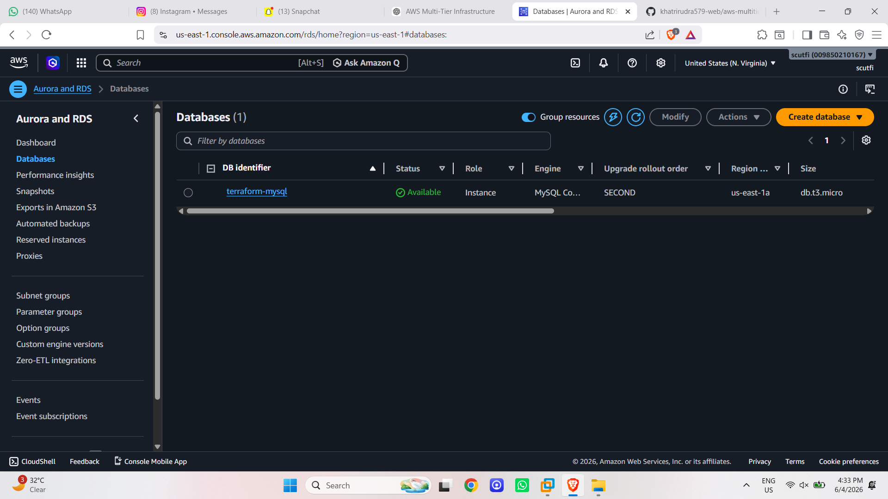
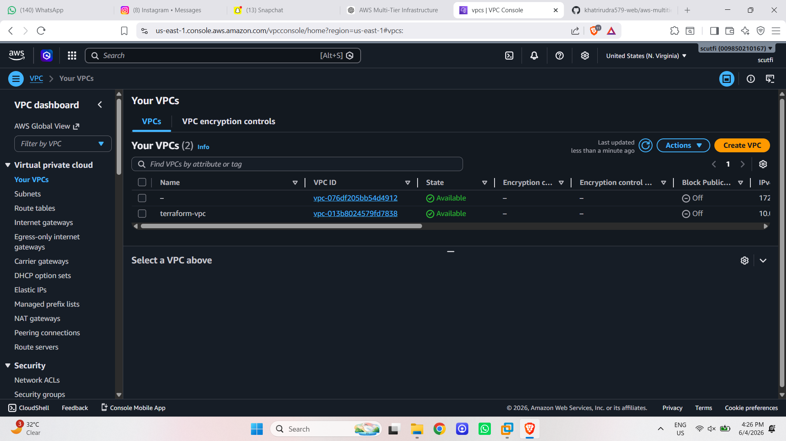

# AWS Multi-Tier Infrastructure with Terraform

## Overview

Provisioned a complete AWS multi-tier architecture using Terraform Infrastructure as Code (IaC).

# Services Used

- Amazon VPC
- Public & Private Subnets
- Internet Gateway
- NAT Gateway
- Route Tables
- Security Groups
- Application Load Balancer
- Auto Scaling Group
- EC2 Instances
- Amazon RDS MySQL

## Architecture


## Application



## Load Balancer



## Target Group Health



## RDS Database



## VPC



## Deployment

```bash
terraform init
terraform validate
terraform plan
terraform apply
```

## Outputs

- ALB DNS Name
- RDS Endpoint
- VPC ID
